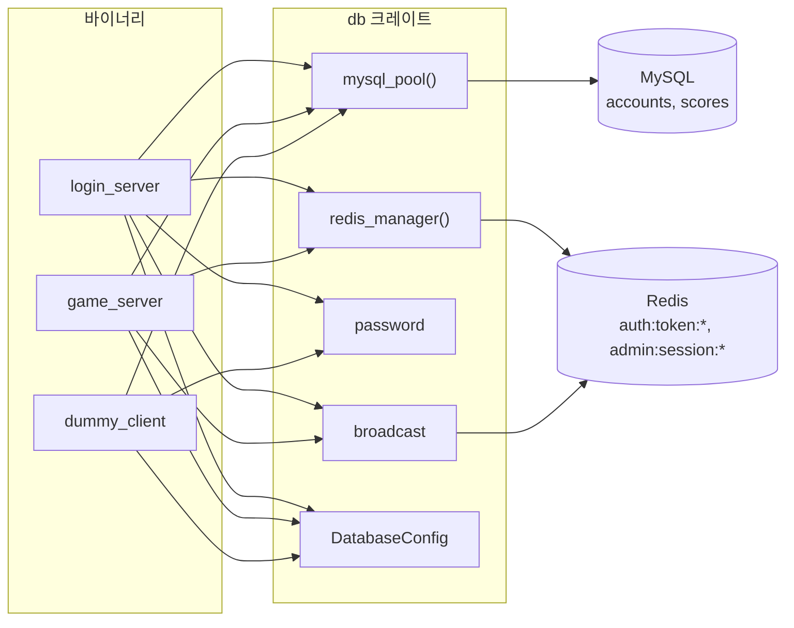
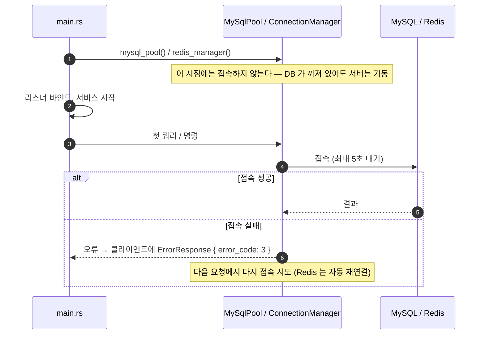
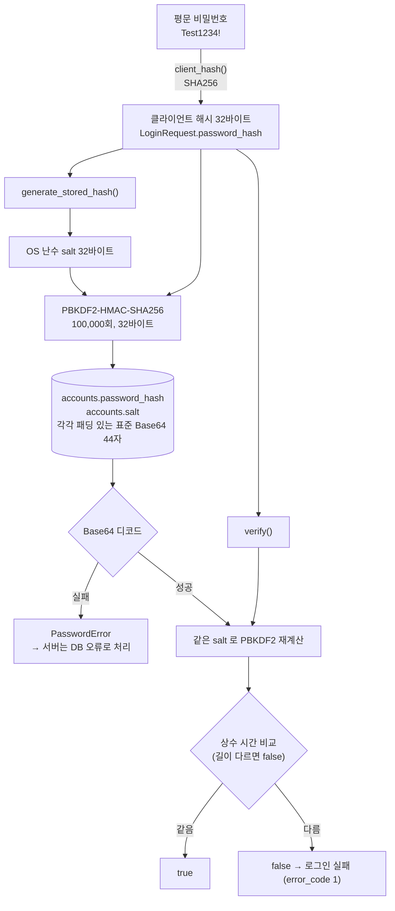
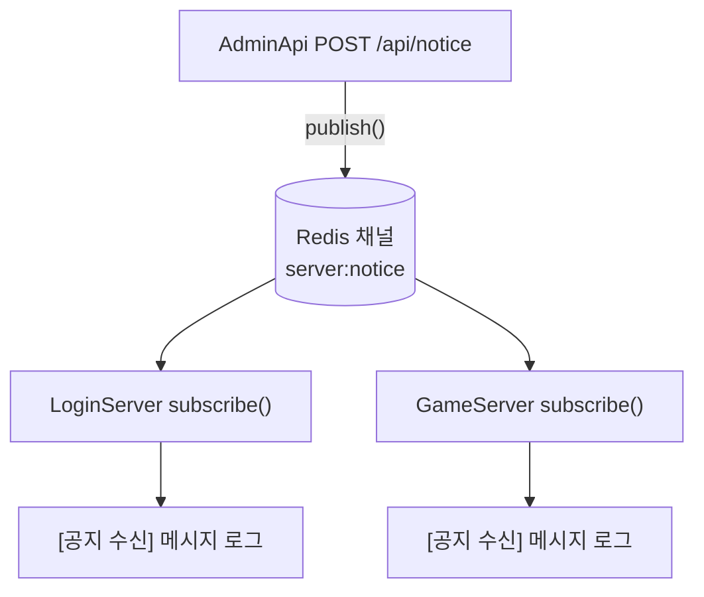
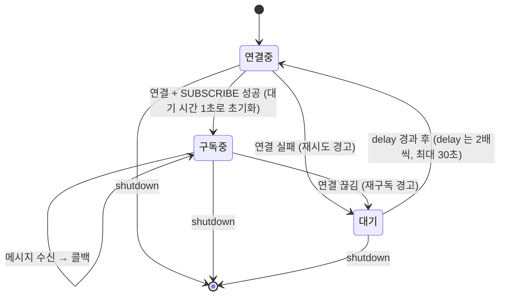

# db

MySQL · Redis 접근 공통 계층.
연결 풀 생성(지연 연결), 헬스 체크, C# `PasswordHashHelper` 호환 비밀번호 해시, Redis Pub/Sub 공지 채널,
그리고 모든 바이너리가 공유하는 `[database]` 설정을 담는다.

쿼리 자체(계정 조회, 점수 저장 등)는 각 서버의 `backend.rs` 에 있다. 이 크레이트는 연결과 공용 기능만 제공한다.

```bash
cargo test -p db         # 비밀번호 해시 테스트 벡터 (DB 없이 실행)
```

## 프로젝트 구조

```
crates/db/
├── Cargo.toml
└── src/
    ├── lib.rs         # MySQL 풀 / Redis ConnectionManager 생성, 헬스 체크, DatabaseConfig, sqlx·redis 재노출
    ├── password.rs    # SHA256 클라이언트 해시 + PBKDF2-HMAC-SHA256 저장 해시 생성·검증
    └── broadcast.rs   # Redis Pub/Sub 공지 발행·구독 (끊기면 백오프 재구독)
```

### 모듈 역할

| 모듈 | 역할 | C# 대응 | 사용처 |
|---|---|---|---|
| `lib.rs` `mysql_pool` | `sqlx::MySqlPool` 을 **지연 연결**로 생성 (첫 쿼리에서 접속, 대기 5초) | `SqlWorkerManager` (워커 32 + 채널) | 두 서버, `--seed` |
| `lib.rs` `redis_manager` | 자동 재연결하는 `ConnectionManager` 를 지연 연결로 생성 (연결·응답 타임아웃 5초) | `CacheWorkerManager` + `ConnectionMultiplexer` | 두 서버 |
| `lib.rs` `check_mysql` / `check_redis` | `SELECT 1` / `PING` | `CheckConnectionAsync` | AdminApi `/api/health` |
| `lib.rs` `DatabaseConfig` | `[database]` 섹션 (URL, 풀 크기, 공지 채널) | `appsettings.json` `Database` | 전부 |
| `password` | 클라이언트 해시, 저장 해시 생성, 상수 시간 검증 | `PasswordHashHelper` | LoginServer, AdminApi 로그인, `--seed`, dummy_client |
| `broadcast` | 공지 `PUBLISH` / 구독 루프 | `RedisBroadcastManager` | 두 서버(구독), AdminApi `/api/notice`(발행) |

`sqlx` 와 `redis` 를 `db::sqlx`, `db::redis` 로 다시 내보내 각 크레이트가 같은 버전을 쓰게 한다.
sqlx 의 `query!` 매크로는 쓰지 않는다 — 컴파일 시점에 DB 접속이 필요해 DB 없는 환경에서 빌드가 안 된다.

## 전체 구조



## 지연 연결



C# 이 `AbortOnConnectFail=false` 와 요청마다 새 `MySqlConnection` 을 열어 DB 없이도 기동되던 동작을 그대로 따른다.
이때 `/api/health` 는 `degraded` 를 돌려준다.

## 비밀번호 해시 (password)



| 단계 | 누가 | 호출 |
|---|---|---|
| 클라이언트 해시 | 클라이언트 (Unity, dummy_client) | `client_hash(평문)` |
| 저장 해시 생성 | `--seed` (C# `AccountSeeder`) | `generate_stored_hash(client_hash)` |
| 검증 | LoginServer 로그인, AdminApi 로그인 | `verify(client_hash, hash_b64, salt_b64)` |

PBKDF2 10만 회는 수십 ms 의 CPU 작업이라 async 코드에서는 `spawn_blocking` 으로 부른다.
debug 빌드에서도 느리지 않도록 워크스페이스 `Cargo.toml` 이 `db`, `sha2`, `hmac`, `pbkdf2` 만 `opt-level = 3` 으로 빌드한다
(제네릭이 호출하는 크레이트에서 단형화되므로 `db` 도 포함해야 효과가 있다).

## 공지 채널 (broadcast)



구독 루프는 연결이 끊겨도 스스로 다시 구독한다 (StackExchange.Redis 자동 재구독 대응).



## 설정 (`[database]`)

| 키 | 기본값 | 설명 |
|---|---|---|
| `mysql_url` | `mysql://root@127.0.0.1:3306/gamedb` | sqlx URL 형식 (C# 연결 문자열 아님). 비밀번호 특수문자는 URL 인코딩 (`!` → `%21`) |
| `mysql_max_connections` | 32 | 풀 최대 연결 수 (C# SQL 워커 32개 대응). `--seed` 는 4 |
| `redis_url` | `redis://127.0.0.1:6379` | |
| `broadcast_channel` | `server:notice` | 공지 Pub/Sub 채널 |

자격증명은 gitignore 된 `config.toml` 이나 `APP_DATABASE__MYSQL_URL` 같은 환경변수에만 둔다.

## 테스트

- `client_hash_is_sha256` — FIPS 180-2 `SHA256("abc")` 벡터
- `pbkdf2_hmac_sha256_vector` — RFC 7914 §11 PBKDF2-HMAC-SHA256 벡터
- `generate_then_verify` — Base64 44자, 맞는/틀린/빈 해시, Base64 아닌 저장값은 오류

C# 이 만든 실제 해시와의 교차 검증은 실제 MySQL 의 C# 시드 계정으로 로그인해 확인한다 (`docs/PORTING.md` 7절).
