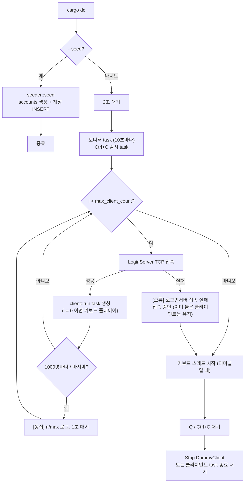
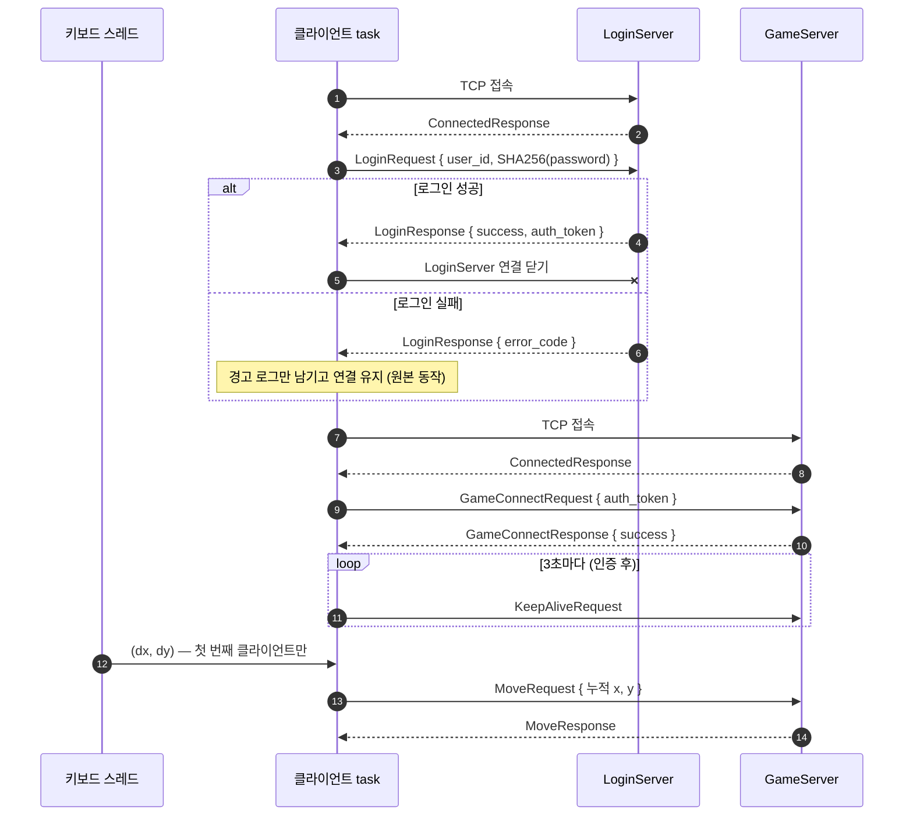
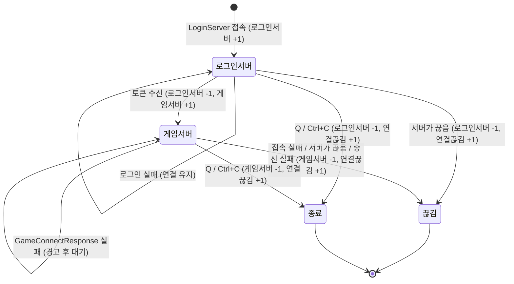
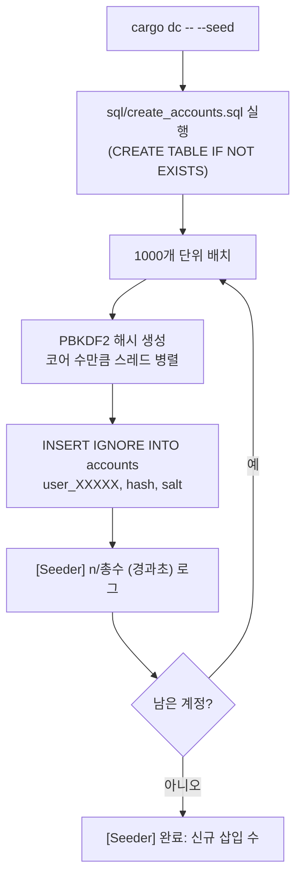

# dummy_client

C# `DummyClient` 를 대체하는 부하·인수 테스트용 더미 클라이언트.
여러 계정으로 LoginServer 에 로그인하고, 받은 토큰으로 GameServer 에 붙어 KeepAlive 를 유지한다.
첫 번째 클라이언트는 키보드로 조종해 이동 요청을 보낼 수 있다. 테스트 계정을 만드는 `--seed` 모드도 있다.

와이어 프로토콜만 쓰므로 Rust/C# 서버 어느 쪽에도 붙는다. 실행 방법·로그 판단은 저장소 루트
[`README.md`](../../README.md) 의 "dummy_client 로 접속 확인" 절을 본다.

```bash
cargo dc -- --seed                               # 테스트 계정 user_00001.. 생성 후 종료
APP_DUMMY_CLIENT__MAX_CLIENT_COUNT=5 cargo dc    # 5명 접속 (기본 10000명)
RUST_LOG=dummy_client=debug cargo dc             # [이동] / [MoveResponse] 까지 출력
cargo test -p dummy_client                       # Rust LoginServer + 가짜 GameServer 로 흐름 테스트
```

## 프로젝트 구조

```
crates/dummy_client/
├── Cargo.toml
├── src/
│   ├── main.rs        # 진입점: --seed 분기, 접속 루프(1000명 단위 배치), 모니터 로그, 종료 처리
│   ├── lib.rs         # 모듈 선언
│   ├── config.rs      # [dummy_client] 설정 (서버 주소, 클라이언트 수, 비밀번호, 시드 계정 수)
│   ├── client.rs      # 클라이언트 1개의 전체 흐름 (로그인 단계 → 게임서버 단계), 단계별 카운터
│   ├── keyboard.rs    # 터미널 raw 모드 키 입력 → 첫 번째 클라이언트 이동, Q/Ctrl+C 종료
│   └── seeder.rs      # --seed: accounts 테이블 생성 + user_00001.. 계정 INSERT IGNORE
└── tests/
    └── end_to_end.rs  # Rust LoginServer(메모리 backend) + 가짜 GameServer 로 흐름 검증
```

### 모듈 역할

| 모듈 | 역할 | C# 대응 |
|---|---|---|
| `main.rs` | 2초 대기(서버 기동 여유) 후 `max_client_count` 개 접속. 1000명마다 1초 쉬고 `[동접]` 로그, 10초마다 `[모니터]` 로그. Ctrl+C/Q 시 모든 클라이언트 종료 대기 | `Program.cs` |
| `client.rs` | 클라이언트 1개 = tokio task 1개. `login_phase` → `game_phase` 순서로 진행하고 끝난 이유(`Finished`)를 돌려준다 | `UserSession` + `Handler/Remote/*` |
| `keyboard.rs` | 별도 OS 스레드에서 키 입력을 읽어 `(dx, dy)` 를 채널로 보낸다. raw 모드라 로그는 `\r\n` 으로 출력 | (원본의 콘솔 입력 처리) |
| `seeder.rs` | PBKDF2 해시를 코어 수만큼 병렬로 만들고 1000개 단위로 바로 INSERT (중단해도 진행분 유지) | `AccountSeeder` |
| `config.rs` | `config.toml` / `APP_DUMMY_CLIENT__*` 환경변수 | `appsettings.json` |

### 다른 크레이트 의존

| 크레이트 | 사용하는 것 |
|---|---|
| `proto` | `MessageWrapper` 등 (와이어 계약) |
| `net` | 2바이트 길이 프레이밍 codec, `KEEP_ALIVE_INTERVAL`(3초), 설정 로더 |
| `db` | `SHA256(비밀번호)` 클라이언트 해시, `--seed` 의 MySQL 풀과 PBKDF2 저장 해시 생성 |
| `login_server` (dev) | 통합 테스트에서 실제 LoginServer 를 띄우는 데만 사용 |

## 실행 구조



- 키보드 입력은 stdin/stdout 이 모두 터미널일 때만 켠다. 파이프나 CI 에서는 키보드 없이 Ctrl+C(SIGINT)로 끝낸다.
- 비밀번호는 `[dummy_client].password` 하나로 시드와 로그인에 같이 쓴다 (원본은 로그인 쪽이 하드코딩).

## 클라이언트 1개의 흐름



- KeepAlive 와 이동은 `GameConnectResponse { success: true }` 를 받은 뒤에만 보낸다. 인증 전에 보내면 서버가 끊기 때문이다.
- 이동 좌표는 키 입력 `(dx, dy)` 를 누적한 값이다 (W=위, S=아래, A=왼쪽, D=오른쪽, 한 번에 1씩).

## 클라이언트 상태와 카운터

`[모니터] 로그인서버: n명 | 게임서버: n명 | 연결끊김: n명` 의 숫자는 아래 전이에서 바뀐다.



| 모니터 값 | 의미 |
|---|---|
| `로그인서버: 0명 \| 게임서버: N명 \| 연결끊김: 0명` | 정상 — 모두 로그인 후 GameServer 에서 KeepAlive 유지 중 |
| `로그인서버` 가 줄지 않음 | 로그인 실패(`[LoginResponse] 로그인 실패` 경고) — 계정·비밀번호 확인 |
| `연결끊김` 이 늘어남 | GameServer 접속 실패(`게임서버 접속 실패`) 또는 서버가 끊음 (KeepAlive 타임아웃, 중복 로그인 킥 등) |

## `--seed` 흐름



이미 있는 계정은 `INSERT IGNORE` 로 건너뛰므로 중간에 멈췄다가 다시 실행해도 된다.

## 테스트

`tests/end_to_end.rs` 는 실제 Rust LoginServer(메모리 backend)와, C# GameServer 의 핸드셰이크
(`ConnectedResponse` → `GameConnectRequest` → `GameConnectResponse`)만 흉내 내는 가짜 GameServer 를 띄운다.

- `login_then_game_server_handshake_and_keep_alive` — 로그인 → 토큰 전달 → 게임서버 인증 → KeepAlive 송신
- `login_failure_stays_connected_until_shutdown` — 로그인 실패 시 연결을 유지하다가 종료 신호에 끝남

실제 GameServer 와의 조합은 테스트가 아니라 `cargo ls` + `cargo gs` + `cargo dc` 실행으로 확인한다.
