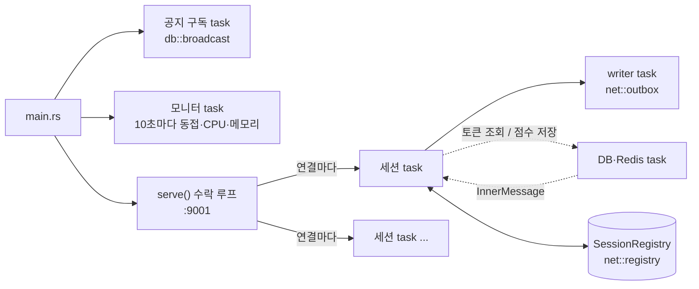
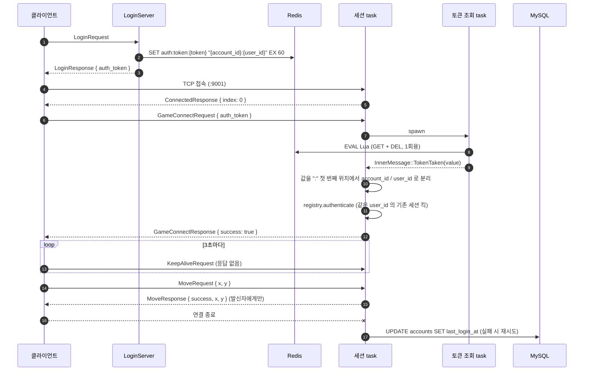
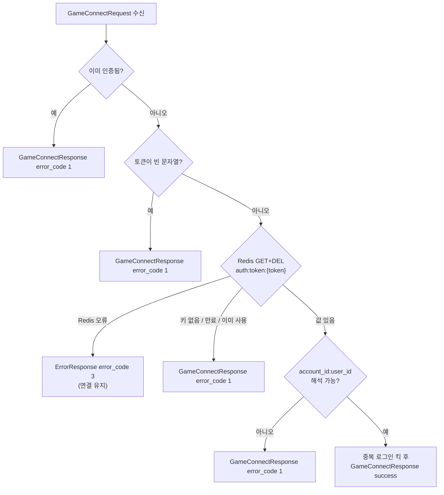
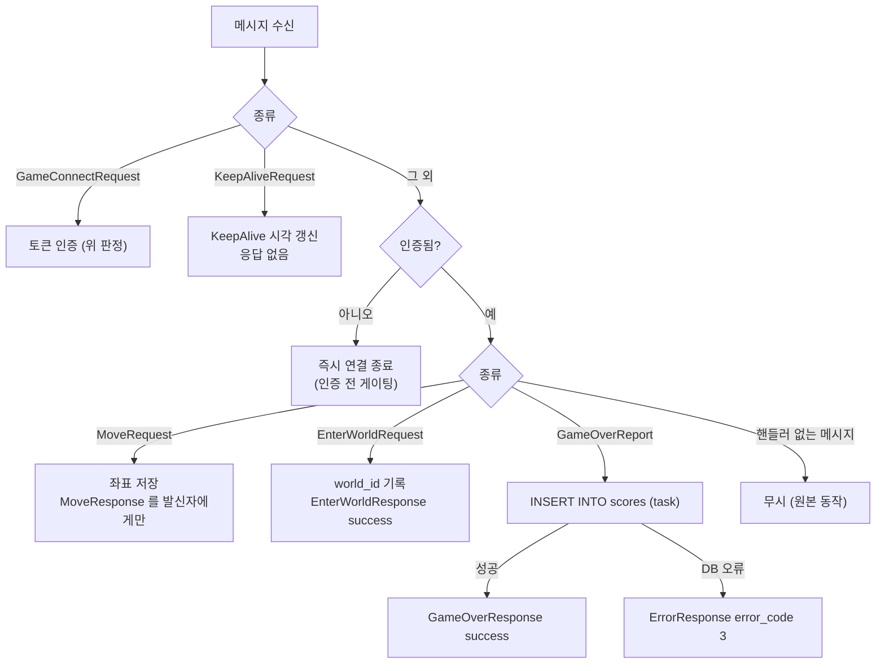
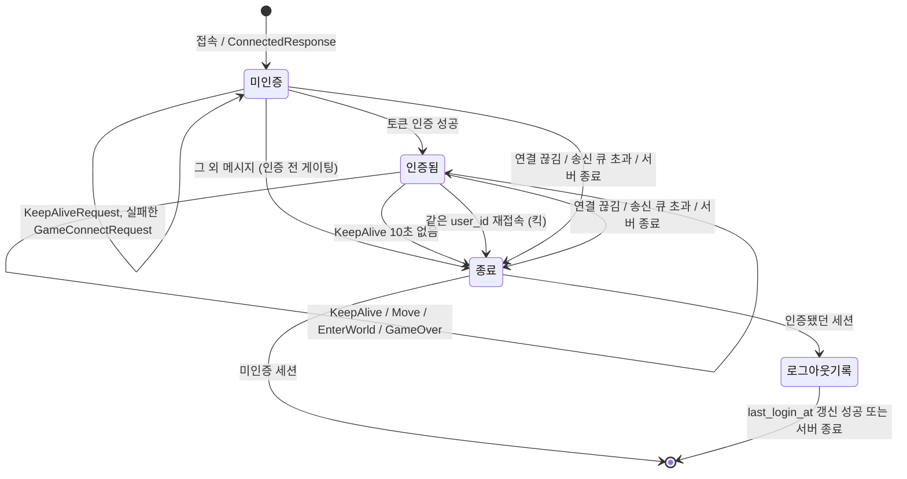
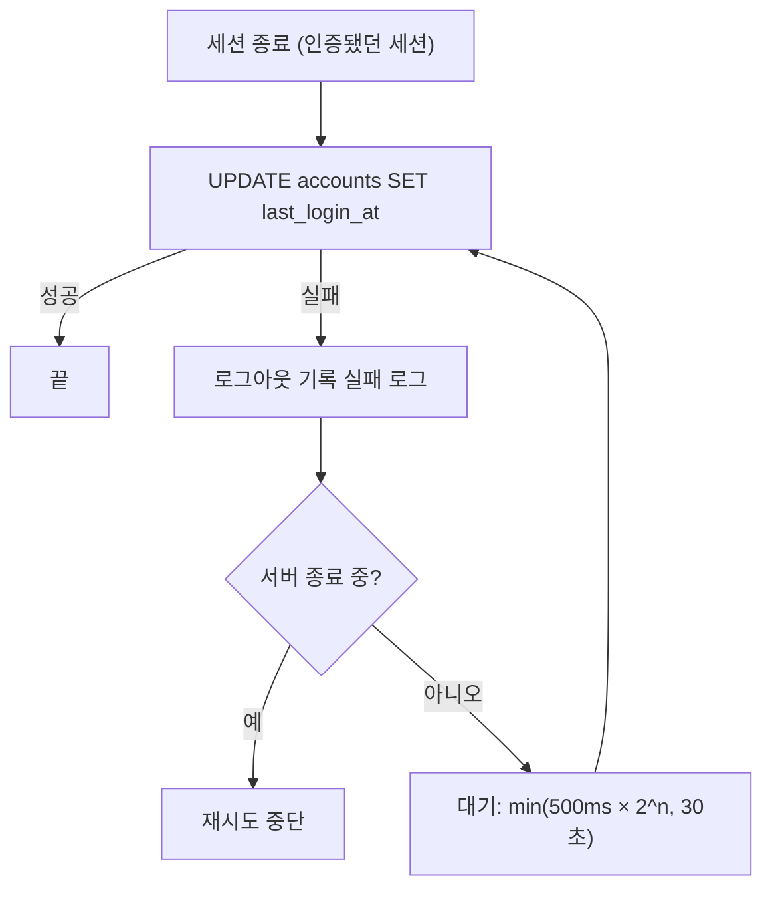

# game_server

C# `GameServer` 를 대체하는 Rust GameServer.
LoginServer 가 Redis 에 발급한 **1회용 인증 토큰**으로 클라이언트를 인증한 뒤, 이동·월드 입장·점수 보고를 처리한다.
LoginServer 와는 직접 통신하지 않고 Redis `auth:token:*` 키로만 이어진다. 그래서 C# LoginServer 와 섞어 붙여도 된다.

실행 방법·설정·로그 판단은 저장소 루트 [`README.md`](../../README.md) 의 "GameServer 실행" 절을,
C# 과의 대응 및 고정된 외부 계약은 [`docs/PORTING.md`](../../docs/PORTING.md) 를 본다.

```bash
cargo gs                                   # = cargo run -p game_server (TCP 9001)
cargo test -p game_server                  # 메모리 backend 로 TCP 통합 테스트
```

## 프로젝트 구조

```
crates/game_server/
├── Cargo.toml
├── src/
│   ├── main.rs        # 바이너리 진입점: 설정 로드, MySQL/Redis 연결, 각 task 기동, Ctrl+C 종료
│   ├── lib.rs         # serve(): 수락 루프 → 연결마다 세션 task 생성, 종료 시 모든 세션 대기
│   ├── config.rs      # [game_server] 설정 구조체와 기본값 (port 9001, auth_token_prefix)
│   ├── backend.rs     # Backend trait (토큰 GET+DEL, 점수 저장, last_login_at 갱신) + MySQL/Redis 구현
│   └── session.rs     # 세션 액터: 메시지 처리, 토큰 인증, KeepAlive, 로그아웃 기록 재시도
└── tests/
    └── game_flow.rs   # 실제 TCP 로 GameServer 동작 검증 (FakeBackend)
```

### 모듈 역할

| 모듈 | 역할 | C# 대응 |
|---|---|---|
| `main.rs` | 설정 로드 → MySQL 풀·Redis 매니저(지연 연결) → 공지 구독·모니터·수락 루프 기동. `Ctrl+C` 시 `CancellationToken` 으로 전체 종료 | `Program.cs`, `TcpGameServer` |
| `lib.rs` | `serve()` — `net::acceptor` 로 연결을 받아 세션 task 를 `TaskTracker` 로 띄우고, 종료 시 모두 끝날 때까지(로그아웃 기록 포함) 기다린다 | `TCPAcceptor.OnAccepted` → `UserObjectPoolManager.AcceptUser` |
| `session.rs` | 연결 1개 = tokio task 1개. task 가 세션 상태(계정, 좌표, world_id)를 소유하므로 락이 없다. `select!` 로 수신·내부 결과·킥·KeepAlive 타이머를 한 루프에서 처리 | `UserSession` + `TickThreadWorker` + `Handler/Remote/*`, `Handler/Inner/*` |
| `backend.rs` | 저장소 접근을 `Backend` trait 으로 분리 — 테스트는 MySQL/Redis 없이 `FakeBackend` 로 대체 | `ValidateTokenCacheRequest`, `SaveScoreSqlRequest`, `LogoutSqlRequest` |
| `config.rs` | `config.toml` / `APP_*` 환경변수에서 읽는 설정 | `appsettings.json` |

C# 에서 버린 것: 세션 객체 풀(`UserObjectPoolManager` 의 풀), `SqlWorkerManager`/`CacheWorkerManager` 워커 풀,
`LobbyThreadManager`/`WorldThreadManager`(세션 등록/해제만 하던 잔재), 리플렉션 핸들러 디스패치.
`world_id` 는 원본처럼 값만 기록한다.

### 다른 크레이트 의존

| 크레이트 | 사용하는 것 |
|---|---|
| `proto` | `message.proto` 에서 생성한 `MessageWrapper` 등 (와이어 계약) |
| `net` | 2바이트 길이 프레이밍 codec, 수락 루프 + IP 플러드 밴, 송신 `outbox`, 세션 `registry`, 모니터, 설정 로더 |
| `db` | MySQL 풀·Redis 매니저 생성, 공지 Pub/Sub(`db::broadcast`) |

`net::registry`(세션 목록·중복 로그인 킥)와 `net::outbox`(송신 writer)는 LoginServer 와 같은 코드다.

## 실행 구조



- 세션 task 는 수신 루프만 돌고, 송신은 별도 writer task 가 맡는다. 송신 큐는 200개로 제한되며 넘치면 세션을 끊는다.
- Redis·MySQL 작업은 세션 루프 밖의 task 에서 돌리고 결과를 `InnerMessage`(`TokenTaken` / `ScoreSaved` / `DbError`)로
  돌려받는다. 응답 송신은 항상 세션 task 가 한다 (C# 의 `EnqueueMessageAsync` → 세션 큐 대응).

## 접속·인증 흐름



## 인증 판정



- 원본의 `error_code 2`(ServerError)는 C# 캐시 워커 채널이 가득 찼을 때만 나온다. 이 포팅에는 그 채널이 없어 보내지 않는다.
- user_id 에 `:` 가 들어 있어도 된다 (`"7:user:with:colons"` → account 7, user `user:with:colons`).

## 메시지 처리



- 이동은 **브로드캐스트하지 않는다** — 원본도 발신자에게 에코만 한다.
- 점수는 원본처럼 `int` 그대로 바인드한다. 컬럼이 `INT UNSIGNED` 라 음수는 DB 오류(`ErrorResponse 3`)가 된다.

## 세션 수명



종료 시 순서: registry 에서 제거 → 남은 송신 큐 비움(최대 1초) → (인증됐던 세션만) `last_login_at` 갱신.

## 로그아웃 기록 재시도

C# `LogoutSqlRequest` 는 critical 요청이라 실패하면 끝까지 재시도한다. 같은 규칙을 세션 task 안에서 수행한다.



첫 시도는 서버 종료 중에도 항상 수행한다. 세션 task 는 `serve()` 의 `TaskTracker` 가 추적하므로 종료 시 첫 시도까지 기다린다.

## 테스트

MySQL/Redis 없이 `FakeBackend` 를 주입해 실제 TCP 소켓으로 검증한다.

- `tests/game_flow.rs`
  - 토큰: 1회용, `:` 포함 user_id, 빈 토큰·없는 토큰·잘못된 값 → 1, 인증 후 재요청 → 1
  - Redis 오류 → `ErrorResponse 3` 이고 연결 유지
  - 인증 전 게이팅 (KeepAlive 허용, Move/EnterWorld/GameOver 는 종료)
  - 이동 에코가 발신자에게만 가는지, 점수 저장 성공/DB 오류
  - 연결 종료·서버 종료 시 `last_login_at` 기록 (인증된 세션만), 중복 로그인 킥
  - KeepAlive 타임아웃 (실제 시간 + `with_keep_alive_timeout` 으로 단축)
- `src/session.rs` 단위 테스트 — 토큰 값 해석, 로그아웃 재시도 백오프(500ms → 1s → 2s), 종료 시 재시도 중단

KeepAlive 테스트에 정지 시계(`start_paused`)를 쓰지 않는 이유: 정지 시계는 실제 소켓 I/O 를 기다리는 동안에도
시간을 건너뛰어, KeepAlive 가 서버에 읽히기 전에 타임아웃이 터진다.
