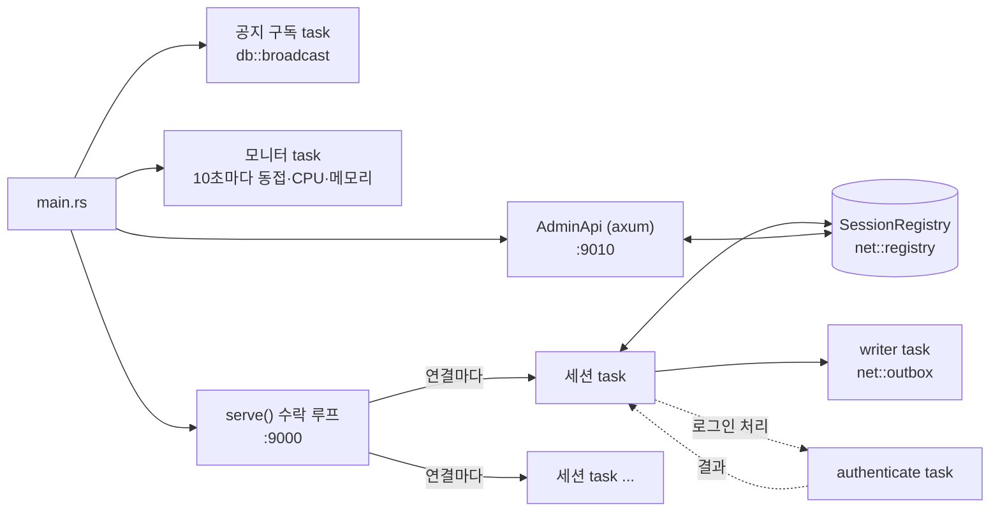
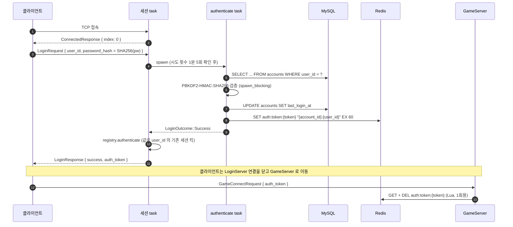
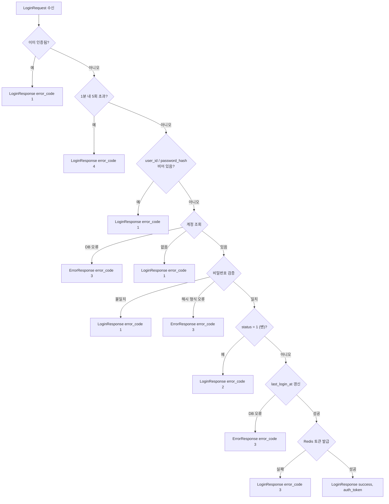
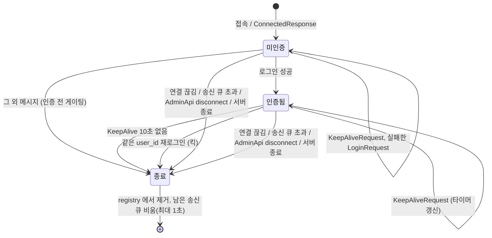
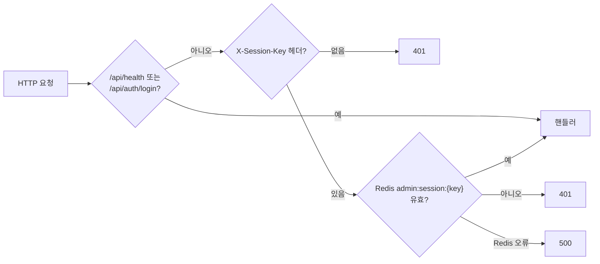

# login_server

C# `LoginServer` 를 대체하는 Rust LoginServer + AdminApi.
계정/비밀번호를 확인하고 GameServer 용 **1회용 인증 토큰**을 Redis 에 발급한다. LoginServer 와 GameServer 는
서로 직접 통신하지 않고 Redis `auth:token:*` 키로만 이어진다.

실행 방법·설정·로그 판단은 저장소 루트 [`README.md`](../../README.md) 의 "LoginServer 실행" 절,
C# 과의 대응 및 고정된 외부 계약은 [`docs/PORTING.md`](../../docs/PORTING.md) 를 본다.

```bash
cargo ls                                   # = cargo run -p login_server (TCP 9000, AdminApi 9010)
cargo test -p login_server                 # 메모리 backend 로 TCP/HTTP 통합 테스트
```

## 프로젝트 구조

```
crates/login_server/
├── Cargo.toml
├── src/
│   ├── main.rs            # 바이너리 진입점: 설정 로드, MySQL/Redis 연결, 각 task 기동, Ctrl+C 종료
│   ├── lib.rs             # serve(): 수락 루프 → 연결마다 세션 task 생성, 종료 시 모든 세션 대기
│   ├── config.rs          # [login_server], [login_server.admin_api] 설정 구조체와 기본값
│   ├── backend.rs         # Backend trait (계정 조회, last_login_at 갱신, 토큰 발급) + MySQL/Redis 구현
│   ├── session.rs         # 세션 액터: 메시지 처리, 로그인 절차, KeepAlive, 시도 횟수 제한
│   └── admin/
│       ├── mod.rs         # AdminApi 라우터, HTTP/HTTPS 기동, 공유 상태(AdminState)
│       ├── handlers.rs    # REST 핸들러 (health, auth, notice, scores, sessions, stats)
│       └── session_key.rs # X-Session-Key 발급·검증 미들웨어 (Redis admin:session:*)
└── tests/
    ├── login_flow.rs      # 실제 TCP 로 로그인 흐름 검증 (FakeBackend)
    └── admin_api.rs       # AdminApi 라우팅·인증 검증
```

### 모듈 역할

| 모듈 | 역할 | C# 대응 |
|---|---|---|
| `main.rs` | 설정 로드 → MySQL 풀·Redis 매니저(지연 연결) → 공지 구독·모니터·AdminApi·수락 루프 기동. `Ctrl+C` 시 `CancellationToken` 으로 전체 종료 | `Program.cs`, `TcpLoginServer` |
| `lib.rs` | `serve()` — `net::acceptor` 로 연결을 받아 세션 task 를 `TaskTracker` 로 띄우고, 종료 시 모두 끝날 때까지 기다린다 | `TCPAcceptor.OnAccepted` → `AcceptUser` |
| `session.rs` | 연결 1개 = tokio task 1개. task 가 세션 상태를 소유하므로 락이 없다. `select!` 로 수신·내부 결과·킥·KeepAlive 타이머를 한 루프에서 처리 | `UserSession` + `TickThreadWorker` + 핸들러들 |
| `backend.rs` | 저장소 접근을 `Backend` trait 으로 분리 — 테스트는 MySQL/Redis 없이 `FakeBackend` 로 대체 | `LoginSqlRequest`, `TryIssueAuthToken` |
| `config.rs` | `config.toml` / `APP_*` 환경변수에서 읽는 설정 | `appsettings.json` |
| `admin/` | axum 기반 관리 API. 세션 키 미들웨어가 라우팅 전에 인증 | `LoginServer/AdminApi/` (`AdminApiHost`, `Controllers/*`, `SessionKeyMiddleware`) |

### 다른 크레이트 의존

| 크레이트 | 사용하는 것 |
|---|---|
| `proto` | `message.proto` 에서 생성한 `MessageWrapper` 등 (와이어 계약) |
| `net` | 2바이트 길이 프레이밍 codec, 수락 루프 + IP 플러드 밴, 송신 `outbox`, 세션 `registry`, 모니터, 설정 로더 |
| `db` | MySQL 풀·Redis 매니저 생성, PBKDF2 비밀번호 검증(`db::password`), 공지 Pub/Sub(`db::broadcast`) |

`net::registry`(세션 목록·중복 로그인 킥)와 `net::outbox`(송신 writer)는 GameServer 와 공유한다.
`login_server::registry` 는 호환을 위해 `net::registry` 를 다시 내보낸 것이다.

## 실행 구조



- 세션 task 는 수신 루프만 돌고, 송신은 별도 writer task 가 맡는다. 송신 큐는 200개로 제한되며 넘치면 세션을 끊는다.
- 로그인(DB 조회 + PBKDF2 + Redis)은 세션 루프 밖의 task 에서 돌리고 결과를 내부 채널로 돌려받는다.
  그래서 DB 가 느려도 세션은 KeepAlive·킥에 계속 반응한다.
- `SessionRegistry` 는 AdminApi 조회·강제 종료와 중복 로그인 킥에 필요한 최소 정보(세션 id, user_id, 킥 토큰)만 가진다.

## 로그인 흐름



## 로그인 판정 순서



- 빈 요청도 시도 횟수를 소모하고, 밴 여부는 비밀번호가 맞을 때만 알려 준다 (원본 순서 그대로).
- DB 오류는 `ErrorResponse`, Redis 토큰 저장 실패는 `LoginResponse { error_code: 3 }` 로 구분된다 (원본 동작).

## 세션 수명



KeepAlive 타임아웃은 **인증된 세션에만** 적용된다. 미인증 세션은 조용히 있어도 끊지 않는다 (원본 동작).

## AdminApi 요청 처리



| 메서드 | 경로 | 설명 |
|---|---|---|
| GET | `/api/health` | DB·Redis 상태 (`ok` / `degraded`) — 인증 불필요 |
| POST | `/api/auth/login` | `{ userId, password }` → `{ sessionKey, expiresInMinutes }`. `admins` 목록의 계정만 — 인증 불필요 |
| POST | `/api/auth/logout` | 세션 키 폐기 |
| POST | `/api/notice` | `{ message }` 를 Redis Pub/Sub 으로 모든 서버에 공지 |
| GET | `/api/scores?accountId=&limit=` | 계정별 최근 점수 (limit 기본 50, 최대 200) |
| GET | `/api/scores/top?limit=` | 상위 점수 (limit 기본 10, 최대 100) |
| GET | `/api/sessions` | LoginServer 에 접속한 세션 목록 |
| POST | `/api/sessions/{session_id}/disconnect` | 세션 강제 종료 |
| GET | `/api/stats` | 동접·누적 패킷·CPU·메모리·가동 시간 |

## 테스트

MySQL/Redis 없이 `FakeBackend` 를 주입해 실제 TCP 소켓으로 검증한다.

- `tests/login_flow.rs` — 로그인 성공/실패 코드(밴·시도 횟수 제한 포함), 인증 전 게이팅, 인증 후 미처리 메시지 무시,
  잘못된 프레임 길이, 중복 로그인 킥, AdminApi 강제 종료, DB/Redis 오류 응답 구분, KeepAlive 타임아웃(실제 시간 + `with_keep_alive_timeout` 으로 단축)
- `tests/admin_api.rs` — 보호 경로의 세션 키 요구, 관리자 로그인 검증, DB/Redis 가 없을 때 `/api/health` 의 `degraded`

KeepAlive 테스트에 정지 시계(`start_paused`)를 쓰지 않는 이유: 정지 시계는 실제 소켓 I/O 나 `spawn_blocking`(PBKDF2)을
기다리는 동안에도 시간을 건너뛰어, KeepAlive 가 서버에 읽히기 전에 타임아웃이 터진다.
