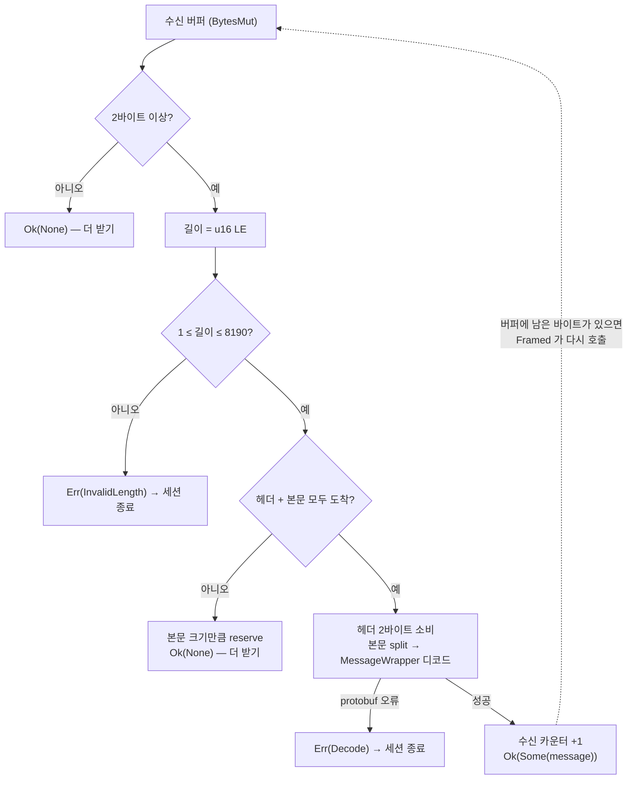
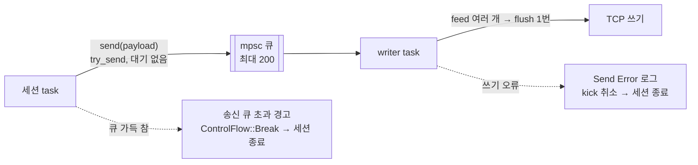
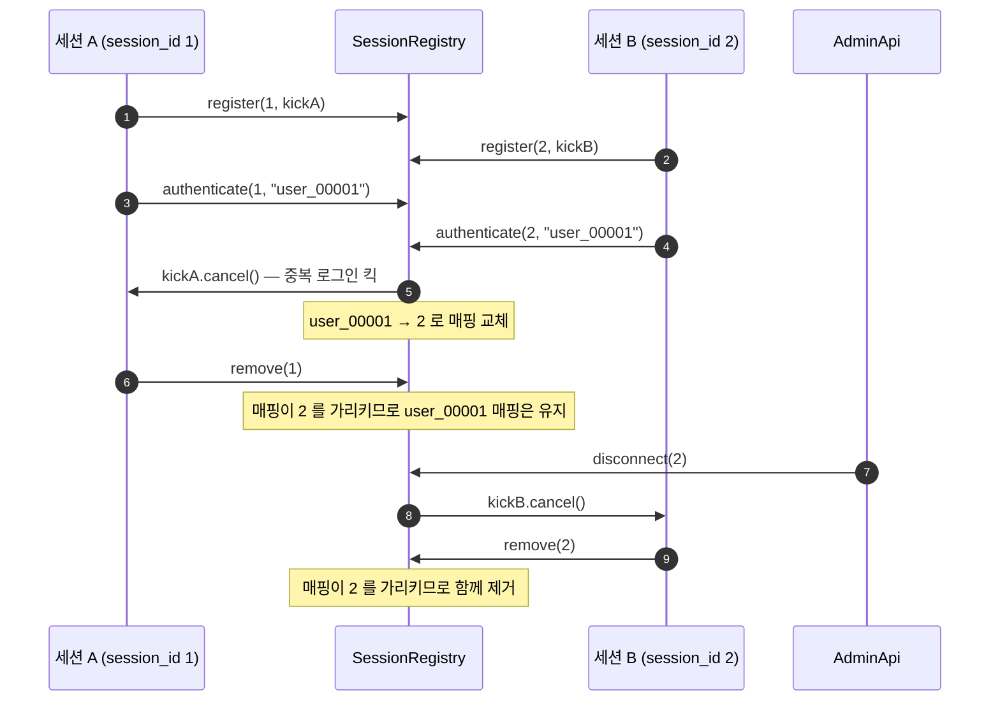
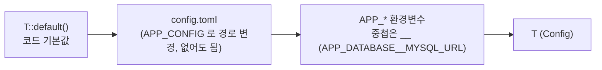
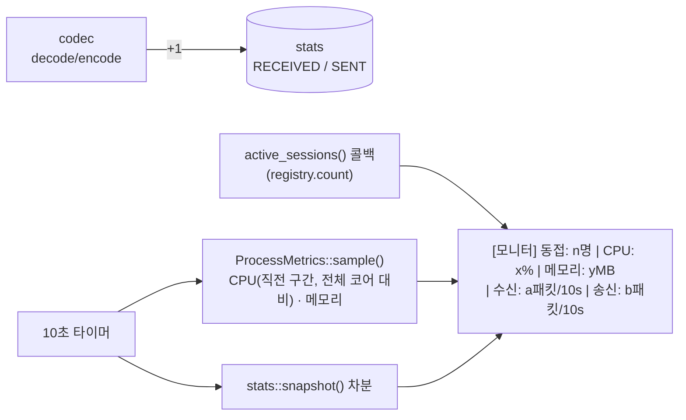

# net

LoginServer · GameServer · dummy_client 가 공유하는 네트워크 공통 계층.
와이어 프레이밍, TCP 수락과 IP 플러드 밴, 세션 송신 경로(outbox), 세션 레지스트리(중복 로그인 킥),
세션 id, 설정 로딩, 패킷 통계, 10초 모니터 로그를 담는다.

**와이어 계약**(2바이트 길이 헤더, 본문 크기 범위, 접속 제한 수치)은 C# 클라이언트와 바이트 단위로 같아야 하므로
여기 값을 바꾸면 안 된다. 계약의 원문은 [`docs/PORTING.md`](../../docs/PORTING.md) 3절에 있다.

```bash
cargo test -p net        # codec 경계 조건, 플러드 밴, 레지스트리 단위 테스트
```

## 프로젝트 구조

```
crates/net/
├── Cargo.toml
└── src/
    ├── lib.rs         # 모듈 선언, MessageCodec/CodecError 재노출, init_tracing()
    ├── codec.rs       # [2바이트 LE 길이][protobuf 본문] 프레이밍 (tokio_util Decoder/Encoder)
    ├── consts.rs      # C# SessionConstInfo 대응 상수 (버퍼·큐 크기, 플러드·KeepAlive 시간)
    ├── acceptor.rs    # 0.0.0.0:port 바인드(backlog 4096), 수락 루프, IP 플러드 밴(ConnectionGuard)
    ├── outbox.rs      # 세션 송신 writer task + 송신 큐(200) + 세션 종료 시 큐 비우기
    ├── registry.rs    # 접속 세션 목록, user_id → 세션 매핑, 중복 로그인 킥, 강제 종료
    ├── session_id.rs  # 프로세스 전역 세션 id (1부터 증가)
    ├── stats.rs       # 프로세스 전역 수신/송신 패킷 카운터 (AtomicU64)
    ├── monitor.rs     # 10초마다 [모니터] 로그, 프로세스 CPU·메모리 측정
    └── config.rs      # 기본값 ← config.toml ← APP_* 환경변수 순서로 설정 로드
```

### 모듈 역할

| 모듈 | 역할 | C# 대응 | 사용처 |
|---|---|---|---|
| `codec` | 길이 헤더 프레이밍 + protobuf 인코딩/디코딩. 디코드마다 수신 카운터, 인코드마다 송신 카운터 증가 | `ReceiveParser`, `SenderHandler.TrySerializeToBuffer` | 전부 |
| `consts` | 계약 상수 모음 | `SessionConstInfo` | 전부 |
| `acceptor` | 리스너 바인드, `accept` 루프, IP 별 버스트 연결 감지·밴 | `TCPAcceptor` | 두 서버 |
| `outbox` | 송신 전용 writer task. 큐가 넘치면 세션을 끊도록 알림 | `SenderHandler` | 두 서버 |
| `registry` | AdminApi 조회·강제 종료, 중복 로그인 킥에 필요한 최소 세션 정보 | `UserObjectPoolManager` 의 `_activeSessions` / `_authenticatedSessions` | 두 서버 |
| `session_id` | 세션 id 발급 | `SessionIdGenerator` | 두 서버 |
| `stats` | 누적 패킷 수 | `PacketStats` | 두 서버 (모니터, AdminApi `/api/stats`) |
| `monitor` | `[모니터] 동접 \| CPU \| 메모리 \| 수신 \| 송신` 로그 | `TcpGameServer.MonitorAsync` | 두 서버 |
| `config` | figment 기반 설정 로더. 각 바이너리가 자기 `Config` 타입으로 호출 | `appsettings.json` + `ConfigurationBuilder` | 전부 |

C# 에서 버린 것: `SocketAsyncEventArgsPool`, 수신 버퍼 압축 로직(→ `BytesMut`), 세션 객체 풀, 틱 스레드.

## 와이어 프레이밍 (codec)

```
[길이: u16 little-endian 2바이트][protobuf MessageWrapper 본문: 길이 바이트]

- 길이는 본문 크기만 담는다 (헤더 2바이트 미포함)
- 유효 범위 1 ~ 8190 (MAX_BUFFER_SIZE 8192 - 2), 벗어나면 연결 종료
- 예) ConnectedResponse { index: 0 } → 02 00 52 00  (본문 2바이트: field 10, 빈 메시지)
```



- 인코드: 본문이 8190 바이트를 넘으면 **그 메시지만 버리고 경고**한다 (연결은 유지 — 원본 동작).
- `MessageWrapper.message_size`(field 1)는 원본에서 아무도 설정하지 않으므로 항상 0 으로 보낸다.
- 9000/9001 에 HTTP 요청이 오면 `"GE"` 가 길이 `17735` 로 읽혀 `InvalidLength` 로 끊긴다 (정상 동작).

## 수락 루프와 플러드 밴 (acceptor)

```mermaid
flowchart TD
    accept["listener.accept()"] -->|오류 (EMFILE 등)| backoff["Fail Accept 경고<br/>10ms 쉬고 재시도"] --> accept
    accept -->|성공| canon["IP 정규화<br/>(IPv4-mapped IPv6 → IPv4)"]
    canon --> allow{"127.0.0.1 / ::1 ?"}
    allow -->|예| pass["on_accepted(stream) → 세션 task"]
    allow -->|아니오| banned{"밴 기간 중?"}
    banned -->|예| drop1["밴된 IP 접속 시도 경고<br/>즉시 닫음"]
    banned -->|아니오| window["최근 10초 기록에서<br/>오래된 항목 제거"]
    window --> flood{"10초 내 30회 이상?"}
    flood -->|예| ban["10분 밴 등록<br/>플러드 감지 경고, 닫음"]
    flood -->|아니오| record["접속 시각 기록"] --> pass
    window -.-> sweep["60초마다 만료 IP 엔트리 정리<br/>(IP 로테이션 공격 대비)"]
    accept -.->|shutdown 취소| stop["루프 종료"]
```

`ConnectionGuard` 는 수락 루프 task 하나가 소유하므로 락이 없다.

## 세션 송신 경로 (outbox)



- 세션 루프는 소켓 쓰기를 기다리지 않는다. 느린 클라이언트는 큐가 차서 끊긴다 (원본의 `MaxSendQueueSize` 200).
- writer 는 큐에 쌓인 메시지를 한꺼번에 버퍼에 넣고 한 번만 flush 한다.
- 세션 종료 시 `Writer::close(outbox)` 가 송신 핸들을 닫고 남은 큐를 **최대 1초** 비운 뒤, 넘으면 중단한다.
- `sleep_until_opt(None)` 은 영원히 대기 — `select!` 에서 "인증된 세션만 KeepAlive 타이머" 같은 조건부 타이머로 쓴다.

## 세션 레지스트리 (registry)



- 세션 상태 자체는 각 세션 task 가 소유한다. 레지스트리는 `(session_id, user_id, 킥 토큰)` 만 가진다.
- `remove` 는 **매핑이 그 세션을 가리킬 때만** user_id 매핑을 지운다. 원본 LoginServer 는 매핑을 지우지 않아
  재사용된 풀 객체의 다른 사용자를 끊을 수 있었다 — 버그로 보고 고쳤다 (`docs/PORTING.md` 4절).
- 킥 토큰은 서버 `shutdown` 의 자식 토큰이라, 서버 종료 시 모든 세션이 함께 끝난다.

## 설정 로딩 (config)



뒤에 오는 것이 앞의 값을 덮어쓴다. 각 바이너리는 자기 섹션만 읽고 나머지 섹션은 무시한다.
자격증명은 gitignore 된 `config.toml` 이나 환경변수에만 둔다.

## 모니터 (monitor, stats)



CPU 는 C# `TotalProcessorTime` 차분과 같은 방식(누적 CPU 시간 차 ÷ (경과 시간 × 코어 수))으로 계산한다.

## 상수 (consts)

| 상수 | 값 | 의미 |
|---|---|---|
| `MAX_BUFFER_SIZE` / `MAX_MESSAGE_BODY_SIZE` | 8192 / 8190 | 본문 최대 크기 (헤더 2바이트 제외) |
| `MAX_LISTENER_BACKLOG` | 4096 | listen backlog |
| `MAX_SEND_QUEUE_SIZE` | 200 | 세션당 송신 큐, 초과 시 세션 종료 |
| `MAX_MESSAGE_CHANNEL_CAPACITY` | 1000 | 세션당 내부 메시지 채널 |
| `FLOOD_WINDOW` / `MAX_CONNECTIONS_PER_WINDOW` / `BAN_DURATION` | 10초 / 30회 / 10분 | IP 플러드 밴 |
| `KEEP_ALIVE_INTERVAL` / `KEEP_ALIVE_TIMEOUT` | 3초 / 10초 | 클라이언트 송신 주기 / 서버 타임아웃 (인증된 세션만) |

## 테스트

자체 인코더로 왕복하는 테스트는 C# 과의 호환성을 증명하지 못하므로, 경계 조건을 직접 만든 바이트로 검증한다.

- `codec` — `ConnectedResponse` 의 실제 와이어 바이트, **1바이트씩** 흘려 넣기(부분 헤더/본문),
  **한 버퍼에 메시지 2개**, 길이 `0`·`8191` 거부, 너무 큰 메시지 인코드는 오류가 아니라 드롭
- `acceptor` — 임계값 초과 시 밴과 만료, 윈도우 슬라이딩, allowlist 와 IPv4-mapped 정규화, 60초 sweep
- `registry` — 중복 로그인 킥, 킥당한 세션이 나중에 정리돼도 새 매핑 유지, 강제 종료
