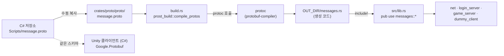
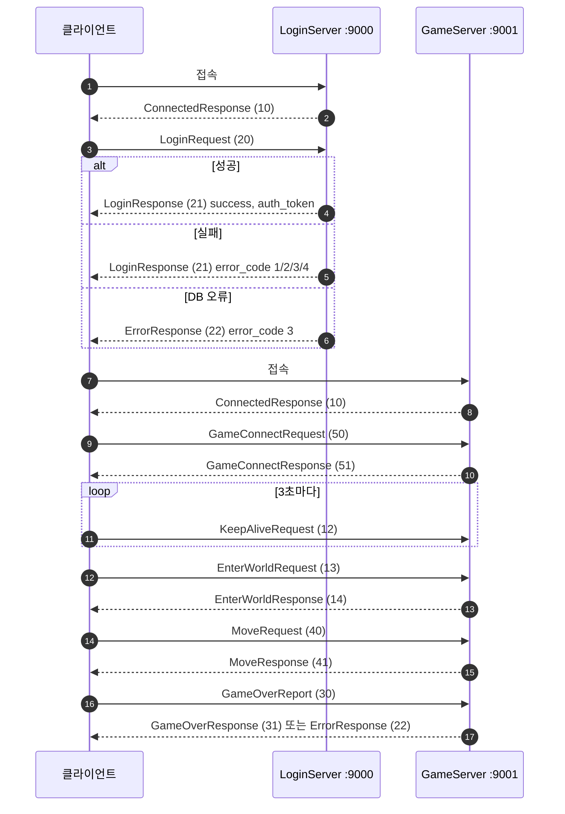

# proto

클라이언트 ↔ 서버 메시지의 protobuf 정의와, 빌드 시 [prost](https://github.com/tokio-rs/prost) 로 생성한 Rust 타입.
`proto/message.proto` 는 원본 C# 저장소(`Scripts/message.proto`)에서 **복사한 파일**이며 와이어 계약 그 자체다.
Unity 클라이언트(C#)가 같은 스키마를 쓰므로 필드 번호·타입을 바꾸면 안 된다. 원본이 바뀌면 다시 복사한다.

```bash
cargo build -p proto     # build.rs 가 protoc 로 message.proto 를 컴파일 (protobuf-compiler 패키지 필요)
cargo test -p proto      # 생성 타입의 와이어 바이트 확인
```

## 프로젝트 구조

```
crates/proto/
├── Cargo.toml         # 의존성: prost (런타임), prost-build (빌드 시)
├── build.rs           # prost_build::compile_protos("proto/message.proto")
├── proto/
│   └── message.proto  # 원본에서 복사한 스키마 (package Messages)
├── src/
│   └── lib.rs         # OUT_DIR/messages.rs 를 include! 하고 루트로 재노출
└── tests/
    └── generated.rs   # ConnectedResponse 의 실제 인코딩 바이트 검사
```

- 생성 코드는 저장소에 커밋하지 않는다. `target/.../out/messages.rs` 에 빌드 때마다 만들어진다.
- `use proto::{MessageWrapper, LoginRequest, ...}` 처럼 크레이트 루트에서 바로 쓴다 (`proto::messages::*` 재노출).
- oneof 는 `proto::message_wrapper::Payload` enum 이 된다.

## 빌드 흐름



`protoc` 가 없으면 빌드가 실패한다 — `sudo apt install -y protobuf-compiler`.

## 메시지 구조

모든 메시지는 `MessageWrapper` 하나로 감싸 보내고, 실제 내용은 `oneof payload` 중 하나다.
`message_size`(field 1)는 원본에서 아무도 설정하지 않아 항상 0 이다. 화살표 옆 숫자는 oneof 필드 번호다.
TCP 위에서는 `net::codec` 이 `[2바이트 LE 길이][MessageWrapper 본문]` 으로 프레이밍한다.

```mermaid
classDiagram
    class MessageWrapper {
        int32 message_size
        oneof payload
    }
    MessageWrapper --> ConnectedResponse : 10
    MessageWrapper --> KeepAliveNoti : 11 (미사용)
    MessageWrapper --> KeepAliveRequest : 12
    MessageWrapper --> EnterWorldRequest : 13
    MessageWrapper --> EnterWorldResponse : 14
    MessageWrapper --> LoginRequest : 20
    MessageWrapper --> LoginResponse : 21
    MessageWrapper --> ErrorResponse : 22
    MessageWrapper --> GameOverReport : 30
    MessageWrapper --> GameOverResponse : 31
    MessageWrapper --> MoveRequest : 40
    MessageWrapper --> MoveResponse : 41
    MessageWrapper --> GameConnectRequest : 50
    MessageWrapper --> GameConnectResponse : 51

    class ConnectedResponse {
        int32 index
    }
    class KeepAliveNoti
    class KeepAliveRequest
    class EnterWorldRequest {
        uint64 world_id
    }
    class EnterWorldResponse {
        bool success
    }
    class LoginRequest {
        string user_id
        bytes password_hash
    }
    class LoginResponse {
        bool success
        int32 error_code
        string auth_token
    }
    class ErrorResponse {
        int32 error_code
    }
    class GameOverReport {
        int32 score
        int32 kill_count
        int32 survive_seconds
    }
    class GameOverResponse {
        bool success
    }
    class MoveRequest {
        float x
        float y
    }
    class MoveResponse {
        bool success
        float x
        float y
    }
    class GameConnectRequest {
        string auth_token
    }
    class GameConnectResponse {
        bool success
        int32 error_code
    }
```



## 메시지 목록

| 번호 | 메시지 | 방향 | 서버 | 설명 |
|---|---|---|---|---|
| 10 | `ConnectedResponse { index }` | S → C | 둘 다 | 접속 직후 즉시 전송. `index` 는 항상 0 |
| 11 | `KeepAliveNoti {}` | — | — | 스키마에만 있고 원본·이 저장소 모두 사용하지 않음 |
| 12 | `KeepAliveRequest {}` | C → S | 둘 다 | 3초마다. 응답 없음. 인증 전에도 허용 |
| 20 | `LoginRequest { user_id, password_hash }` | C → S | Login | `password_hash` = `SHA256(평문)` 32바이트 |
| 21 | `LoginResponse { success, error_code, auth_token }` | S → C | Login | 0=성공, 1=인증 실패, 2=밴, 3=서버 오류, 4=횟수 제한 |
| 22 | `ErrorResponse { error_code }` | S → C | 둘 다 | 3 = DB/Redis 오류 |
| 50 | `GameConnectRequest { auth_token }` | C → S | Game | LoginServer 가 준 1회용 토큰 |
| 51 | `GameConnectResponse { success, error_code }` | S → C | Game | 0=성공, 1=토큰 무효, 2=서버 오류(이 포팅에서는 보내지 않음) |
| 13 | `EnterWorldRequest { world_id }` | C → S | Game | 인증 후. world_id 기록 |
| 14 | `EnterWorldResponse { success }` | S → C | Game | 항상 `true` |
| 40 | `MoveRequest { x, y }` | C → S | Game | 인증 후. 좌표 저장 |
| 41 | `MoveResponse { success, x, y }` | S → C | Game | 발신자에게만 에코 (브로드캐스트 없음) |
| 30 | `GameOverReport { score, kill_count, survive_seconds }` | C → S | Game | 인증 후. `scores` 테이블에 INSERT |
| 31 | `GameOverResponse { success }` | S → C | Game | 저장 성공 시 |

## 메시지 흐름



인증 전에 허용되는 메시지는 LoginServer 는 `LoginRequest`·`KeepAliveRequest`, GameServer 는 `GameConnectRequest`·`KeepAliveRequest`
뿐이다. 그 외를 보내면 서버가 즉시 연결을 끊는다.

## 인코딩 예시

`MessageWrapper { payload: ConnectedResponse { index: 0 } }`

```
본문:      52 00          field 10 (wire type 2 = length-delimited) → 0x52, 길이 0
프레임:    02 00 52 00    net::codec 이 앞에 본문 길이 2 (u16 LE) 를 붙인다
```

proto3 는 기본값(0, false, 빈 문자열)을 인코딩하지 않는다. 그래서 `index: 0` 과 `message_size: 0` 은 바이트에 나타나지 않는다.

## 주의

- **필드 번호·타입·패키지명(`Messages`)을 바꾸지 않는다.** C# 클라이언트와 바이트 단위로 호환되어야 한다.
- `message_size`(field 1)는 원본에서 아무도 설정하지 않는다. Rust 쪽도 항상 0 으로 둔다.
- 스키마를 바꿔야 하면 원본 C# 저장소에서 먼저 바꾸고 이 파일을 다시 복사한다 (파일 첫 줄의 출처 주석 유지).
