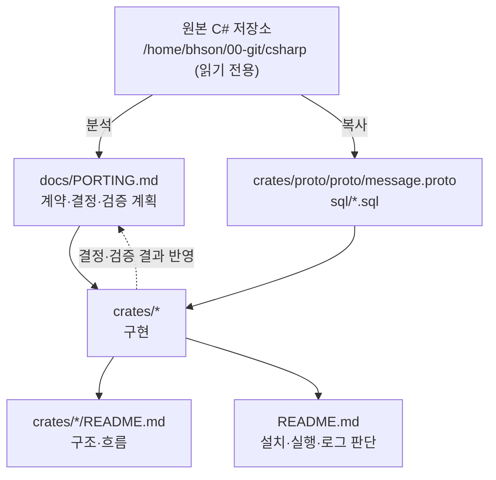

# docs

프로젝트 설계 문서 모음. 코드를 고치기 전에 먼저 읽는다.

| 문서 | 내용 |
|---|---|
| [PORTING.md](PORTING.md) | C# → Rust 변환 설계서 — 무엇을 유지하고 버리는지, 변경 불가능한 외부 계약, 원본 불일치에 대한 결정, 검증 계획 |

실행 방법은 저장소 루트 [README.md](../README.md), 크레이트별 구조와 흐름은 각 크레이트 README 를 본다.

## PORTING.md 목차

| 절 | 내용 | 이럴 때 본다 |
|---|---|---|
| [0. 대원칙](PORTING.md#0-대원칙) | 내부 구조는 Rust 답게, 외부 계약은 바이트 단위로 동일하게 | 설계 판단이 애매할 때 |
| [1. 변환 대응표](PORTING.md#1-변환-대응표) | C# 구성요소 ↔ Rust 구현, 유지하는 것 / 버리는 것 | C# 코드가 Rust 어디로 갔는지 찾을 때 |
| [2. 작업 순서](PORTING.md#2-작업-순서) | LoginServer → dummy_client → GameServer 진행 상태 | 지금 어디까지 됐는지 볼 때 |
| [3. 고정된 외부 계약](PORTING.md#3-고정된-외부-계약-변경-불가) | 와이어 프레이밍, 접속 직후 응답, 인증 전 게이팅, Redis 토큰, KeepAlive, 핸들러 동작, DB 스키마, 접속 제한, 상수 | **클라이언트가 관측하는 동작을 바꿀 때 — 여기와 다르면 안 된다** |
| [4. 원본의 불일치](PORTING.md#4-원본의-불일치--결정-필요) | 원본의 버그·모순과 이 포팅이 택한 쪽 | "원본과 왜 다르지?" 싶을 때 |
| [5. 워크스페이스 구성](PORTING.md#5-워크스페이스-구성) | 크레이트 배치, 주요 의존 크레이트 | 새 크레이트·의존성을 추가할 때 |
| [6. 보안 — 자격증명](PORTING.md#6-보안--자격증명) | 설정·비밀번호를 어디에 두는지 | 설정 항목을 추가할 때 |
| [7. 검증 계획](PORTING.md#7-검증-계획) | 판별력 있는 테스트 목록과 완료 여부 | 테스트를 추가하거나 인수 테스트를 할 때 |

## 문서와 코드의 관계

## 문서 갱신 규칙

- **외부 계약(3절)은 원본 C# 을 기준으로만 바꾼다.** Rust 쪽 편의로 바꾸지 않는다.
- 원본과 다르게 동작하도록 결정했다면 **4절 표에 한 줄 추가**한다 (원본 상태 / 이 포팅의 결정).
- 크레이트 단계가 끝나면 2절 상태를, 테스트나 실환경 확인이 끝나면 7절 체크리스트를 갱신한다.
- 크레이트 구조·흐름이 바뀌면 해당 `crates/*/README.md` 를, 실행 방법·설정이 바뀌면 루트 `README.md` 를 고친다.

## 남은 검증 (PORTING.md 7절)

- [ ] 실제 MySQL 의 C# 시드 계정으로 Rust LoginServer 로그인 (PBKDF2 호환성 최종 확인)
- [ ] Rust LoginServer + C# GameServer + C# DummyClient
- [ ] Rust dummy_client + C# LoginServer/GameServer
- [ ] **C# DummyClient 를 수정 없이 Rust GameServer 에 붙여 통과** ← 최종 인수 조건

진행 상황의 기준은 PORTING.md 이다. 이 목록은 요약이므로 갱신할 때 둘 다 맞춘다.
